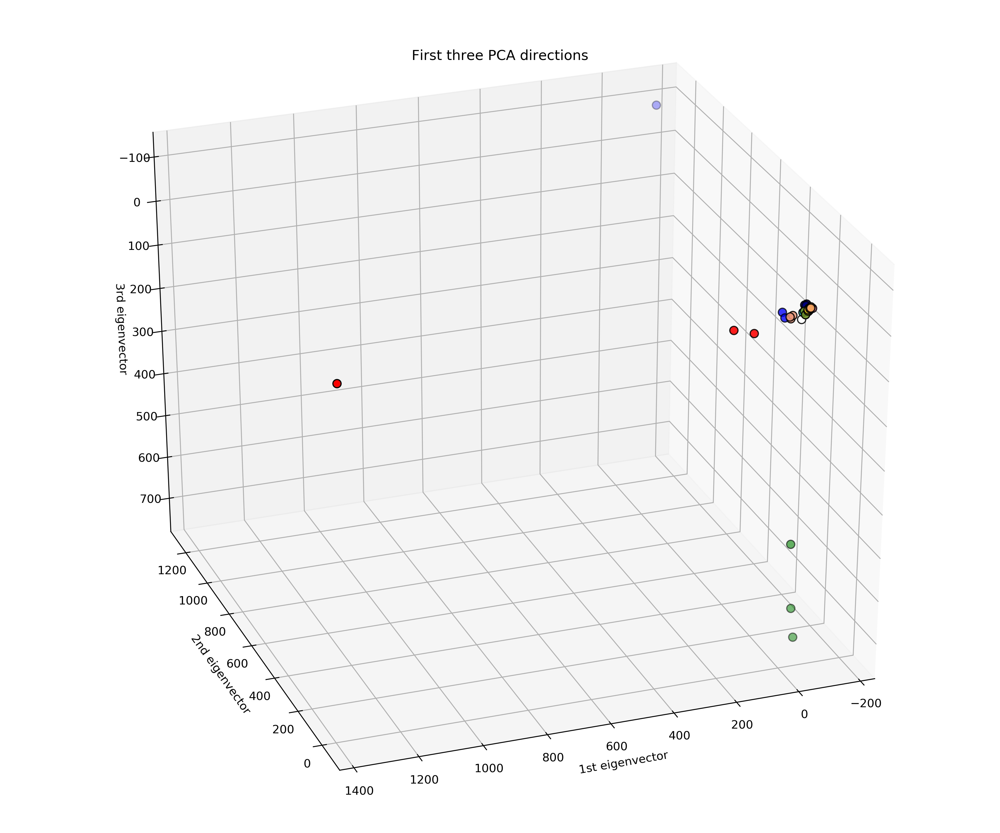
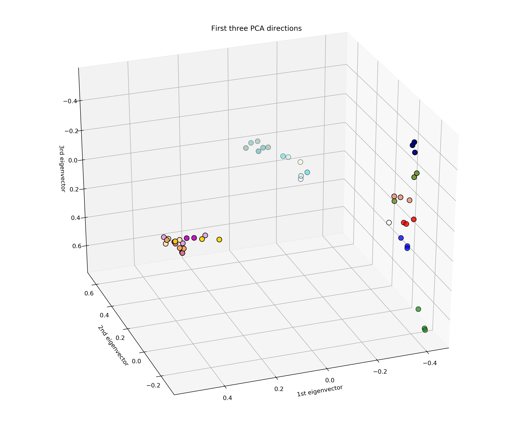
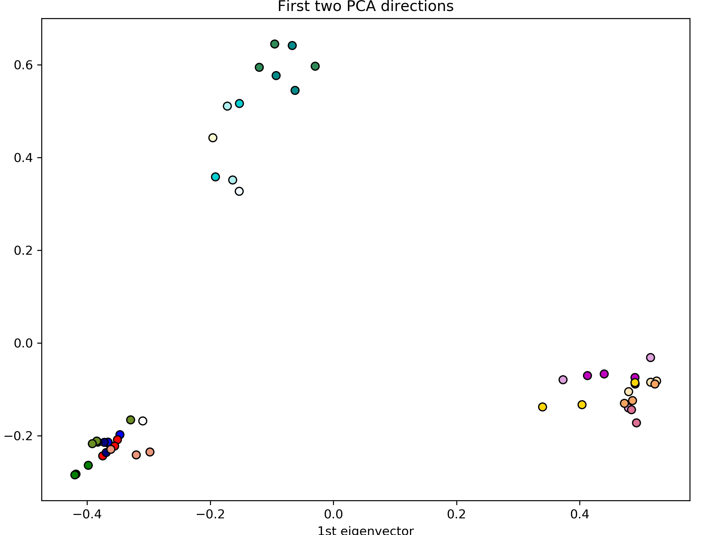

## Feature scaling for PCA

In PCA, we are interested in the components that maximize the variance. If feature A varies less than feature B 
because of their respective scales, PCA could determine that the direction of maximal variance more closely corresponds
with the B axis, if those features are not scaled.

Here I have a dataset with 49 samples while each sample has about 90,000 features. This is typical for 
bioinformatic data where tons of features such as genes are observed for each sample. Suppose these
90,000 features are gene count data (non-negative integers). Before normalizing the values for each sample, a 3-component
PCA plot would look like this.

By normalizing each sample's values with l2 norm (scaling input vectors individually to unit norm), the PCA
plot would look rather differently. The following two plots are showing 3D and 2D PCA for the same dataset
 with normalization.

