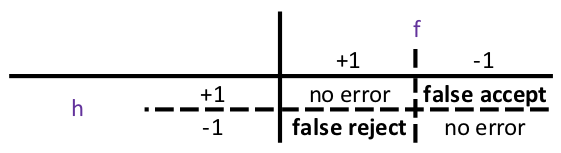

## How to choos the error measue

Let's use fingerprint verification as an example. There are two types of error:
* false accept (false positive)
* false reject (false negative)

Which error should we penalize?

In the following table, f is the true function (or fingerprint value in this case) with +1 being true
and -1 being false. h is the hypothesis and its +1 and -1 inferred using h.

Minimizing one error (false accept) over the other (false reject) is an application domain question rather than
an analytical question.

### Application I: supermarkets
Suppose supermarkets want to verify customers' fingerprint for discounts. False reject is costly: customers
can get really annoyed if they are falsely rejected more often at the checkout and it would result in a long
 waiting line. 
 
 Comparatively, false accept does not cause trouble to customers by falsely accepting
  more fingerprints and giving more discounts away. Supermarkets may earn a little
less by falsely accepting more customers for discounts but supermarkets are getting more fingerprints information
which is a big give-away from the customers' stand point. 

Therefore, we want to put a smaller weight on the 
'false accept' error (making it looser) and a bigger weight on the 'false reject' error (making it more stringent so
that a customer is less likely to get rejected)

### Application II: security
Suppose an important agency wants to verify fingerprints for security issues, such as entering the building or 
completing large dollar amount transactions. False accept in this case is more costly and may bring disasters while 
false reject would be a tolerated for being risk-averse.

Thus, we want to put a larger weight on the 'false accept' (making less likely to be false positive) and a smaller
weight on the 'false reject' (tolerating more false negatives and the fact that more people are being rejected).

##### Reference
http://work.caltech.edu/telecourse.html
